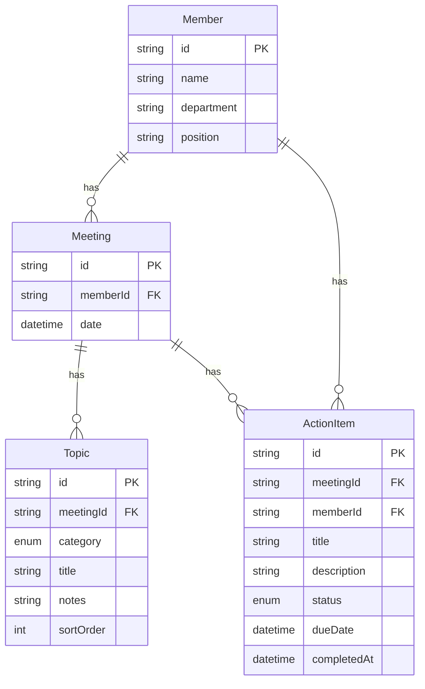

# Nudge - 1on1 ミーティングトラッカー

Nudge は 1on1 ミーティングの記録・管理を行うシングルユーザー向けローカル Web アプリケーションです。
メンバー管理、ミーティング記録（トピック・アクションアイテム）、進捗トラッキングを提供します。

## 主な機能

- **ダッシュボード** — メンバー一覧とサマリー統計（総メンバー数・ミーティング数・アクションアイテム数）を表示
- **メンバー管理** — 1on1 対象メンバーの登録・編集・削除、アバターイニシャル自動生成
- **1on1 ミーティング記録** — トピック（カテゴリ分類: 業務進捗・キャリア・課題・フィードバック・その他）・メモの作成・編集・削除と履歴管理、ドラッグ＆ドロップによる直感的な並び替え（順序の永続化）
- **前回ミーティング参照** — ミーティング作成・準備時に前回のトピック・アクションアイテムをサイドバーで表示
- **アクションアイテム管理** — ミーティングで決まった TODO の追跡・ステータス管理（TODO / 進行中 / 完了）、インライン編集、フィルタリング機能
- **モダンな UI/UX** —
  - レスポンシブ UI（デスクトップ固定サイドバー / モバイルハンバーガーオーバーレイ、パンくずナビゲーション）
  - 楽観的更新（Optimistic Updates）による即時状態反映
  - トースト通知による操作アクションのフィードバック
  - 誤削除を防止する確認ダイアログ
  - カスタムエラーページ等を用いた堅牢なエラーハンドリング

## 技術スタック

| カテゴリ         | 技術                                                  |
| ---------------- | ----------------------------------------------------- |
| フレームワーク   | Next.js 16 (App Router) + React 19                    |
| データベース     | Prisma ORM + SQLite                                   |
| スタイリング     | Tailwind CSS 4 + shadcn/ui + Radix UI                 |
| デザインシステム | Hearth テーマ（OKLch カラーパレット、Geist フォント） |
| バリデーション   | Zod 4                                                 |
| テスト           | Vitest + Testing Library + jsdom                      |
| アイコン         | lucide-react                                          |
| コード品質       | ESLint, Prettier, husky + lint-staged                 |
| CI/CD            | GitHub Actions（Lint・TypeCheck・Test・Build）        |
| 言語             | TypeScript 5 (strict mode)                            |

## セットアップ

```bash
# リポジトリをクローン
git clone https://github.com/dtakamiya/nudge.git
cd nudge

# 依存関係をインストール
npm install

# 環境変数を設定
cp .env.example .env
# .env の DATABASE_URL を確認（デフォルト: file:./dev.db）

# データベースをセットアップ
npx prisma migrate dev
npx prisma db seed

# 開発サーバーを起動
npm run dev
```

[http://localhost:3000](http://localhost:3000) でアプリケーションにアクセスできます。

## 開発コマンド

```bash
# 開発
npm run dev          # 開発サーバー起動
npm run build        # 本番ビルド
npm run lint         # ESLint チェック
npm run format       # Prettier で全ファイルフォーマット
npm run format:check # Prettier チェック

# テスト
npm test             # テスト実行（vitest run）
npm run test:watch   # テスト ウォッチモード

# データベース
npx prisma migrate dev   # マイグレーション実行
npx prisma db seed       # シードデータ投入
npx prisma generate      # Prisma クライアント生成
npx prisma studio        # Prisma Studio 起動
```

## CI/CD

GitHub Actions で以下のジョブが PR・push 時に自動実行されます:

1. **Lint & Format** — ESLint + Prettier チェック
2. **TypeCheck** — `tsc --noEmit` による型チェック
3. **Test** — Vitest によるユニットテスト
4. **Build** — 本番ビルド（上記 3 ジョブ成功後）

## データモデル



**トピックカテゴリ**: `WORK_PROGRESS` | `CAREER` | `ISSUES` | `FEEDBACK` | `OTHER`

**アクションアイテムステータス**: `TODO` | `IN_PROGRESS` | `DONE`

## プロジェクト構造

```
src/
├── app/                        # Next.js App Router ページ
│   ├── actions/                # アクションアイテム一覧ページ
│   ├── members/
│   │   ├── new/                # メンバー新規作成ページ
│   │   └── [id]/
│   │       ├── page.tsx        # メンバー詳細・編集ページ
│   │       └── meetings/
│   │           ├── new/        # ミーティング新規作成ページ
│   │           └── [meetingId]/ # ミーティング詳細ページ
│   ├── globals.css             # テーマ変数・アニメーション定義
│   ├── layout.tsx              # ルートレイアウト（フォント・サイドバー統合）
│   └── page.tsx                # ダッシュボード
├── components/
│   ├── action/                 # アクションアイテム コンポーネント
│   │   ├── action-filters.tsx  #   フィルタリング UI
│   │   ├── action-list-compact.tsx # コンパクト表示
│   │   └── action-list-full.tsx    # フル表示
│   ├── dashboard/              # ダッシュボード コンポーネント
│   │   └── dashboard-summary.tsx   # サマリーカード
│   ├── layout/                 # レイアウト コンポーネント
│   │   ├── breadcrumb.tsx      #   パンくずナビゲーション
│   │   └── sidebar.tsx         #   サイドバー
│   ├── meeting/                # ミーティング コンポーネント
│   │   ├── meeting-detail.tsx  #   詳細表示
│   │   ├── meeting-form.tsx    #   作成・編集フォーム
│   │   ├── meeting-history.tsx #   履歴一覧
│   │   └── previous-meeting-sidebar.tsx # 前回ミーティング参照
│   ├── member/                 # メンバー コンポーネント
│   │   ├── member-form.tsx     #   作成・編集フォーム
│   │   └── member-list.tsx     #   一覧表示
│   └── ui/                     # shadcn/ui ベースコンポーネント
│       ├── avatar-initial.tsx, badge.tsx, button.tsx, card.tsx,
│       ├── dialog.tsx, input.tsx, label.tsx, select.tsx,
│       └── separator.tsx, table.tsx, textarea.tsx
├── generated/prisma/           # Prisma 生成クライアント
└── lib/
    ├── __tests__/              # ユーティリティのユニットテスト
    ├── actions/                # Server Actions
    │   ├── __tests__/          #   Server Actions テスト
    │   ├── action-item-actions.ts
    │   ├── dashboard-actions.ts
    │   ├── meeting-actions.ts
    │   └── member-actions.ts
    ├── validations/            # Zod バリデーションスキーマ
    │   ├── __tests__/          #   バリデーション テスト
    │   ├── action-item.ts
    │   ├── meeting.ts
    │   └── member.ts
    ├── avatar.ts               # アバターイニシャル・グラデーション生成
    ├── constants.ts            # アプリ定数
    ├── format.ts               # 日付フォーマット ユーティリティ
    ├── prisma.ts               # Prisma クライアント シングルトン
    └── utils.ts                # 汎用ユーティリティ
prisma/
├── schema.prisma               # データベーススキーマ
├── seed.ts                     # シードデータ
└── migrations/                 # マイグレーションファイル
```

## ライセンス

Private
