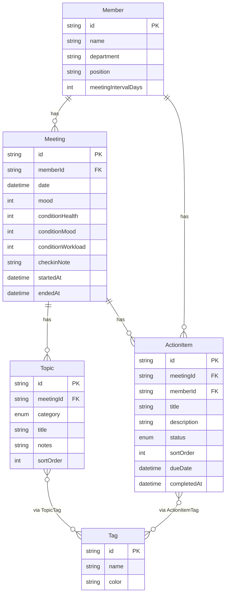

# Nudge - 1on1 ミーティングトラッカー

Nudge は 1on1 ミーティングの記録・管理を行うシングルユーザー向けローカル Web アプリケーションです。
メンバー管理、ミーティング記録（トピック・アクションアイテム）、進捗トラッキングを提供します。

## 主な機能

- **ダッシュボード** — メンバー一覧とサマリー統計（総メンバー数・ミーティング数・アクションアイテム数）を表示
- **メンバー管理** — 1on1 対象メンバーの登録・編集・削除、アバターイニシャル自動生成
- **1on1 ミーティング記録** — トピック（カテゴリ分類: 業務進捗・キャリア・課題・フィードバック・その他）・メモの作成・編集・削除と履歴管理、ドラッグ＆ドロップによる直感的な並び替え（順序の永続化）
- **リアルタイム記録モード** — ミーティング開始・終了時刻の記録、経過時間表示、キーボードショートカット対応
- **チェックイン機能** — 健康・気分・業務負荷のコンディションスコア入力とメモ記録
- **コーチングアシスト UI** — マネージャー向けに次のアクション・話題提案を提示
- **前回ミーティング参照** — ミーティング作成・準備時に前回のトピック・アクションアイテムをサイドバーで表示
- **アクションアイテム管理** — ミーティングで決まった TODO の追跡・ステータス管理（TODO / 進行中 / 完了）、インライン編集、フィルタリング機能
- **タグ/ラベル機能** — 色付きタグによるトピック・アクションアイテムの分類・絞り込み
- **アナリティクス** — ミーティング頻度・トピック分布・アクション完了率などのチャート可視化
- **ダークモード対応** — next-themes によるライト/ダーク切り替え
- **モダンな UI/UX** —
  - レスポンシブ UI（デスクトップ固定サイドバー / モバイルハンバーガーオーバーレイ、パンくずナビゲーション）
  - 楽観的更新（Optimistic Updates）による即時状態反映
  - トースト通知による操作アクションのフィードバック
  - 誤削除を防止する確認ダイアログ
  - カスタムエラーページ等を用いた堅牢なエラーハンドリング

## 技術スタック

| カテゴリ         | 技術                                                          |
| ---------------- | ------------------------------------------------------------- |
| フレームワーク   | Next.js 16 (App Router) + React 19                            |
| データベース     | Prisma ORM + SQLite                                           |
| スタイリング     | Tailwind CSS 4 + shadcn/ui + Radix UI                         |
| デザインシステム | Slate & Indigo テーマ（OKLch カラーパレット、Geist フォント） |
| バリデーション   | Zod 4                                                         |
| チャート         | recharts                                                      |
| ダークモード     | next-themes                                                   |
| DnD              | @dnd-kit/core + @dnd-kit/sortable                             |
| テスト           | Vitest + Testing Library + jsdom / Playwright (E2E)           |
| テストデータ     | @faker-js/faker                                               |
| アイコン         | lucide-react                                                  |
| コード品質       | ESLint, Prettier, husky + lint-staged                         |
| CI/CD            | GitHub Actions（Lint・TypeCheck・Test・Build）                |
| 言語             | TypeScript 5 (strict mode)                                    |

## セットアップ

```bash
# リポジトリをクローン
git clone https://github.com/dtakamiya/nudge.git
cd nudge

# 依存関係をインストール
npm install

# 環境変数を設定
cp .env.example .env
# .env の DATABASE_URL を確認（デフォルト: file:./dev.db）

# データベースをセットアップ
npx prisma migrate dev
npx prisma db seed

# 開発サーバーを起動
npm run dev
```

[http://localhost:3000](http://localhost:3000) でアプリケーションにアクセスできます。

## 開発コマンド

```bash
# 開発
npm run dev          # 開発サーバー起動
npm run build        # 本番ビルド
npm run lint         # ESLint チェック
npm run format       # Prettier で全ファイルフォーマット
npm run format:check # Prettier チェック

# テスト
npm test             # テスト実行（vitest run）
npm run test:watch   # テスト ウォッチモード

# データベース
npx prisma migrate dev   # マイグレーション実行
npx prisma db seed       # シードデータ投入
npx prisma generate      # Prisma クライアント生成
npx prisma studio        # Prisma Studio 起動
```

## CI/CD

GitHub Actions で以下のジョブが PR・push 時に自動実行されます:

1. **Lint & Format** — ESLint + Prettier チェック
2. **TypeCheck** — `tsc --noEmit` による型チェック
3. **Test** — Vitest によるユニットテスト
4. **Build** — 本番ビルド（上記 3 ジョブ成功後）

## データモデル


```mermaid
erDiagram
    Member ||--o{ Meeting : has
    Member ||--o{ ActionItem : has
    Meeting ||--o{ Topic : has
    Meeting ||--o{ ActionItem : has
    Topic }o--o{ Tag : "via TopicTag"
    ActionItem }o--o{ Tag : "via ActionItemTag"

    Member {
        string id PK
        string name
        string department
        string position
        int meetingIntervalDays
    }

    Meeting {
        string id PK
        string memberId FK
        datetime date
        int mood
        int conditionHealth
        int conditionMood
        int conditionWorkload
        string checkinNote
        datetime startedAt
        datetime endedAt
    }

    Topic {
        string id PK
        string meetingId FK
        enum category
        string title
        string notes
        int sortOrder
    }

    ActionItem {
        string id PK
        string meetingId FK
        string memberId FK
        string title
        string description
        enum status
        int sortOrder
        datetime dueDate
        datetime completedAt
    }

    Tag {
        string id PK
        string name
        string color
    }
```

**トピックカテゴリ**: `WORK_PROGRESS` | `CAREER` | `ISSUES` | `FEEDBACK` | `OTHER`

**アクションアイテムステータス**: `TODO` | `IN_PROGRESS` | `DONE`

## プロジェクト構造

```
src/
├── app/                        # Next.js App Router ページ
│   ├── actions/                # アクションアイテム一覧ページ
│   ├── analytics/              # アナリティクスページ
│   ├── members/
│   │   ├── new/                # メンバー新規作成ページ
│   │   └── [id]/
│   │       ├── page.tsx        # メンバー詳細・編集ページ
│   │       └── meetings/
│   │           ├── new/        # ミーティング新規作成ページ
│   │           ├── prepare/    # ミーティング準備ページ
│   │           └── [meetingId]/ # ミーティング詳細・記録ページ
│   ├── globals.css             # テーマ変数・アニメーション定義
│   ├── layout.tsx              # ルートレイアウト（フォント・サイドバー統合）
│   └── page.tsx                # ダッシュボード
├── components/
│   ├── action/                 # アクションアイテム コンポーネント
│   ├── analytics/              # アナリティクス コンポーネント（recharts グラフ群）
│   ├── dashboard/              # ダッシュボード コンポーネント
│   ├── layout/                 # レイアウト コンポーネント（サイドバー・パンくず）
│   ├── meeting/                # ミーティング コンポーネント（DnD・リアルタイム記録含む）
│   ├── member/                 # メンバー コンポーネント
│   ├── tag/                    # タグ コンポーネント（badge・filter・input）
│   └── ui/                     # shadcn/ui ベースコンポーネント
├── generated/prisma/           # Prisma 生成クライアント（gitignore 対象）
├── hooks/                      # カスタム React フック
│   ├── use-debounce.ts         #   デバウンス
│   ├── use-elapsed-time.ts     #   経過時間（リアルタイム記録）
│   └── use-keyboard-shortcuts.ts # キーボードショートカット
└── lib/
    ├── actions/                # Server Actions（データ変更処理）
    ├── validations/            # Zod スキーマ
    ├── avatar.ts               # アバターイニシャル・グラデーション生成
    ├── meeting-templates.ts    # ミーティングテンプレート定義
    ├── prisma.ts               # Prisma クライアント シングルトン
    ├── constants.ts            # アプリ定数
    ├── format.ts               # 日付フォーマット ユーティリティ
    └── utils.ts                # 汎用ユーティリティ（cn）
prisma/
├── schema.prisma               # データベーススキーマ
├── seed.ts                     # シードデータ
└── migrations/                 # マイグレーションファイル
```

## ライセンス

Private
